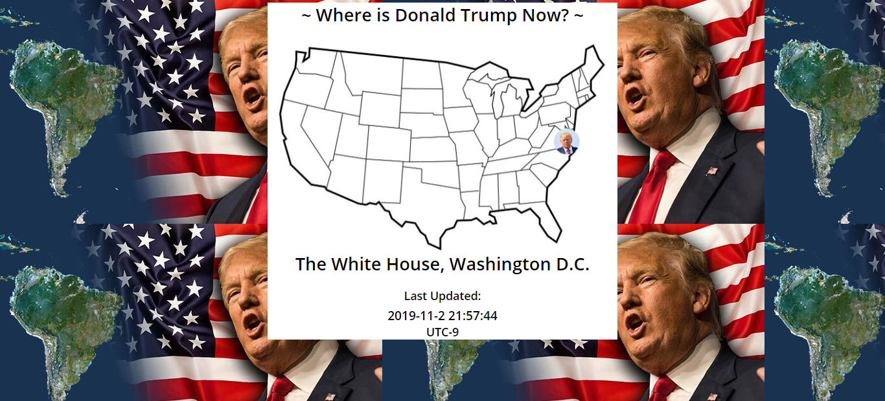
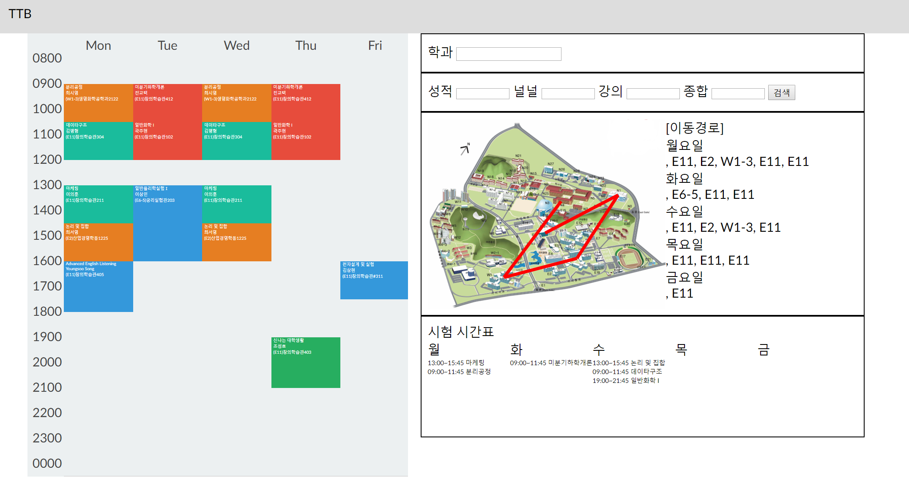
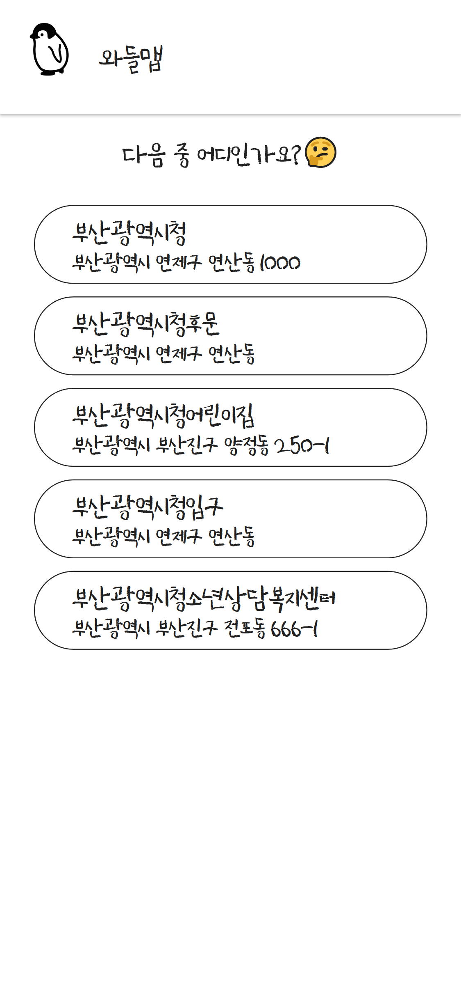
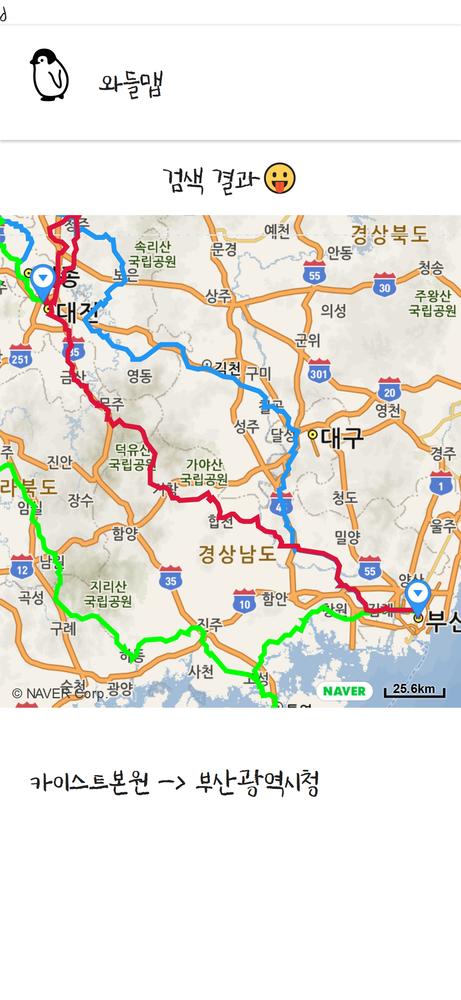
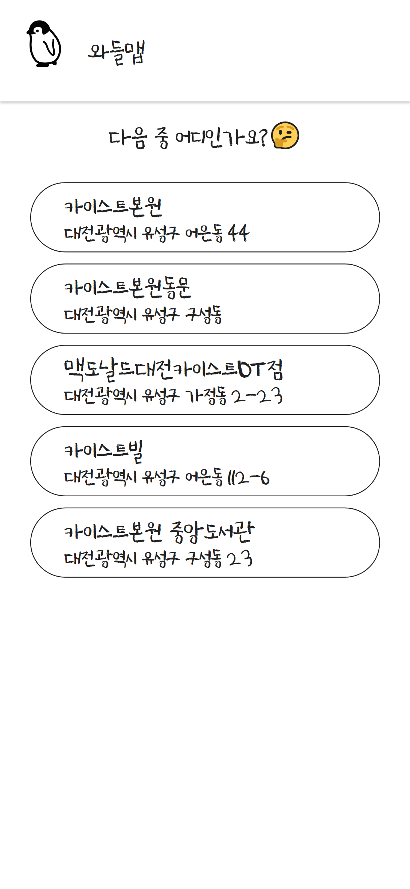
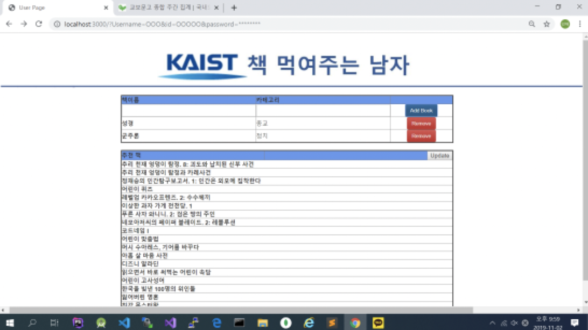
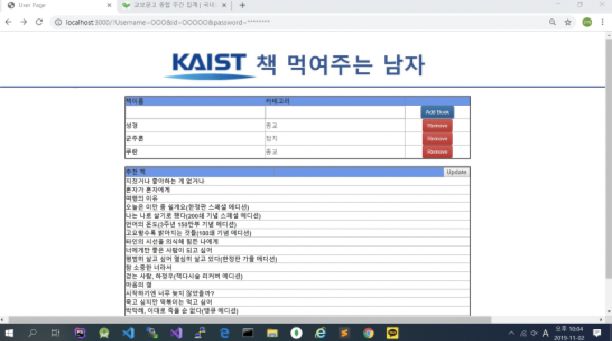
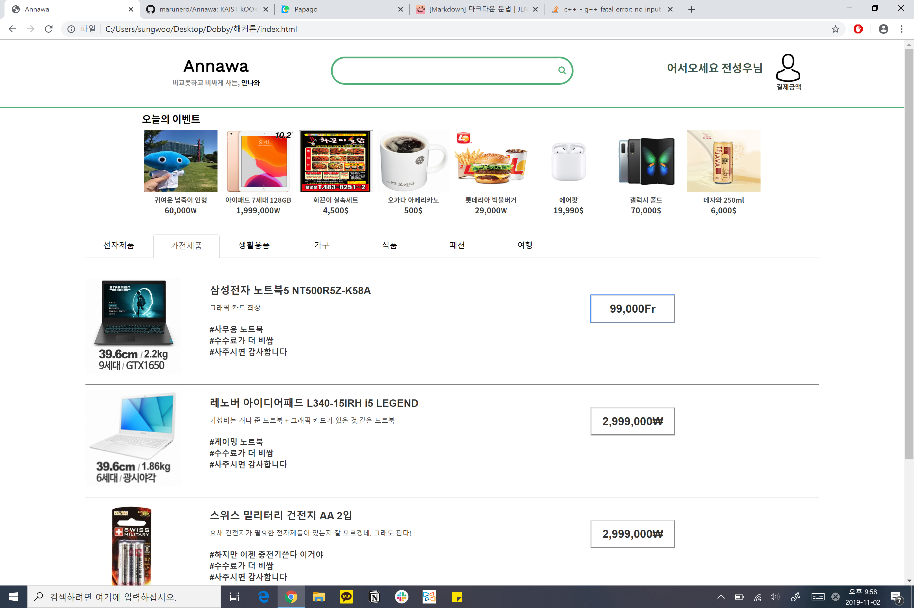
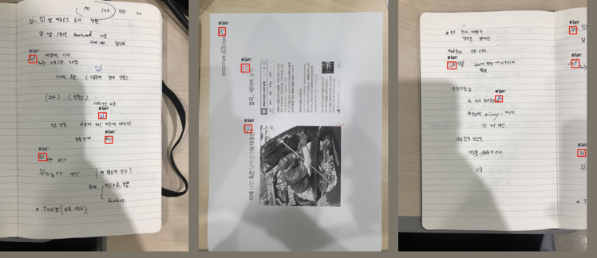

# kOOk

> KAIST Prototyping Group, kOOk

<iframe src="https://team-kook.github.io/old" style="height: 600px">
</iframe>


# kOOk 무쓸모톤

> 우린 너무 쓸모 있느라 지쳤다.

2019년 11월 1일 오후 3시부터 2019년 11월 2일 오후 10시까지 **<무쓸모톤 : 쓸모 없는 것들의 가치>**를 진행했어요. 총 10개의 팀이 참여를 해서 10개의 **쓸모 없는** 프로젝트가 만들어졌습니다!!! 하나씩 볼까요?

## 오버쿡

> 언제까지 정해준 대로만 살 거야

언제까지 정해준 대로만 살 순 없지. 내 운세는 내가 만든다. @[kOOk](https://team-kook.github.io)무쓸모톤 @[GitHub에서 코드 보기](https://github.com/sleepy-juan/Todays-Luck)


더 이상 오늘의 운을 정해주는 운세 앱은 없습니다. 나의 운세는 이제 내가 결정해요. 앱을 실행하면 *재물운*, *사업운*, *애정운*, *건강운* 중 하나를 선택할 수 있습니다. 그리고 운을 결정하면 운에 대한 여러가지 설명 중 원하는 *상세 운*을 결정할 수 있습니다. 운세 앱인데 *행운의 아이템*이 빠지면 섭섭하죠. 행운의 아이템도 원하는 것이 나올 때까지 계속해서 고를 수 있습니다!

그럼, 오늘도 운이 가득한 하루 되세요.

## Where is Donald Trump Now?

Where is Donald Trump Now?, or WDTN in short, shows where Trump is on the U.S. map. It is in semi-real time, loading the data every time the page is refreshed. 

### User Experience



**Trump on the Map** The picture of Donald Trump is placed on the U.S. map, roughly showing where he actually is. 

**Current Time in Your Time Zone** In order to show the users that the information they're getting is concurrent, the website also displays the current time in their local time zone.

**Your Best Trump Experience** The website also displays HD portrait of Donald Trump with the U.S. flag behind, to allow the users the best Trump experience possible.

#### Why not the 'exact' location?

I have ways to know the exact location of Donald Trump, but if I display that on a public website, he may find me before any of my user finds him.

### The Backend

Now you may wonder how I figure out Trump's current location. I get my information from the following site, where nearly all kind of facts about Trump are presented in an organised manner.

 https://factba.se/topic/calendar 

I used the method of 'Mechanical Turk' to locate Trump on the map, which is basically, I have to update my website every time Trump moves. 

## GNU

[GNU APK 다운 받기](4.apk)

## TTB - Terrible Time Table generator

OTL 평가를 기반으로 만들 수 있는 최악의 시간표를 만들어보자!

@[kook](https://github.com/team-kook) 무쓸모톤

### 구성

1. OTL parser
2. 시간표 생성
3. 시간표 띄우기

### OTL parser

Written in Python

thanks to [OTL](otl.kaist.ac.kr)

학교 홈페이지에서 다운받은 전체개설교과목 엑셀 파일을 바탕으로 beautifulsoup를 이용하여 otl.kaist.ac.kr 에 request를 보내서 각 과목별로 review 데이터를 수집한다. review가 없는 경우에는 ?로 남겨둠

### 시간표 생성

### 시간표 띄우기

Written in HTML/CSS, Javascript

thanks to [Li Kai](https://codepen.io/likai/pen/NrqXLm)

시간표 템플릿은 위의 코드를 이용하였다.
학과와 리뷰의 가중치를 포함하여 서버에 request를 보내고 시간표를 받는다.
서버로부터 받은 response를 가지고 시간표를 띄운다.

### 스크린샷



### 작성자

- [권기훈](https://github.com/KwonKyoon)
- [황민영](https://github.com/Daniel-H-99)

## THABNOS

무분별하게 컴퓨터 리소스를 낭비하는 전산학부 학생들에게 분노한 타노스가 탭을 날려버리려 합니다. 당신은 아이언맨이 되어 잔악무도한 타노스를 물리치고 탭을 지켜내야 합니다. 타노스를 물리치지 못할 경우 탭의 절반이 사라지게 됩니다.

배경음악은 세계 최고의 아티스트들과 협업하여 만들어졌고, 현대미술의 거장 로모토스키 한이 일러스트에 참여했습니다. 설정을 통해 타노스가 가지고 있는 인피니티 스톤의 개수와 한번 클리어 했을 때 쉬었다 오는 시간을 지정할 수 있습니다.

THABNOS는 크롬 익스텐션으로 개발되었고, 현재 크롬 웹 스토어 심사 과정에 있습니다. 다음 github 링크를 통해서도 다운로드 받을 수 있습니다.

그럼 고생 좀 해보시기 바랍니다.

https://www.github.com/sklationd/TVI


## CodingThreeMeals: No Need Annoying Alarm Service

This application sets an alarm at random timestamp.

When executing the application, it itself sets alarm at the time between 12:00 PM and 8:00 PM.

We selected 13 kinds of musics; we chose videos in youtube that we think are annoying, and converted them to mp3.

Examples are:

```
Coconut song - https://youtu.be/w0AOGeqOnFY 
Yee - https://youtu.be/q6EoRBvdVPQ
I'm confusion - https://youtu.be/yYlnW7-vJ1A
Ahri Death Scream All Languages - https://www.youtube.com/watch?v=eA8u1tkgRxU
```

Until the user completes the mission, the music never stops and the user cannot even adjust the volume. Mission is to press the back button 50 times.

## 와들

[발표 PPT 보기](8.pptx) | [발표 대본 보기](8.txt)

### 발표 대본

금산 휴게소의 소시지가 3500원이라는 것을 아시나요? 갑천이 어디서 끝나는 지 아시나요?
이제는 알게 될 겁니다. 와들맵과 함께라면요.


저희는 네비게이션을 만들었습니다.
네비게이션은 차로 이동할 때 최단 경로를 알려주는 편리한 도구입니다.
저희의 웹 역시 역시 두 장소 간의 경로를 알려줍니다.



그럼 웹을 사용하는 모습을 보여드릴까 합니다.
출발지와 도착지를 각각 카이스트, 그리고 부산광역시청으로 잡아보겠습니다.
먼저 출발지에 카이스트를 입력하면,


정확한 위치를 정하기 위해 후보 다섯개를 보여줍니다.
그 중 하나를 선택하면,



카이스트원으로 이름이 바뀌며 출발지가 확정됩니다.


부산광역시청의 경우도 마찬가지구요


출발지와 도착지를 둘 다 선택했다면, 이제 한번 저희 앱이 추천하는 경로를 보도록 하겠습니다.



뭔가 이상함을 눈치챘나요?
네 그렇습니다.
저희는 최단거리를 제공하지 않습니다.
한참 돌아가는 길만 보여줄 뿐입니다.
저희 앱은 고속도로가 아닌 국도로만 가는 길을 경로로 제시합니다.
그리고 출발지와 목적지 사이에 있는 임의의 도로를 잡아 그곳을 경유지로 삼습니다.
그리고, 출발지와 도착지, 경유지를 이동하는 경로의 좌표를 지도에 그려서 사용자에게 제공합니다.
지도와 경로는 네이버 api를 이용하여 얻었습니다.


다시 한번 로고를 살펴볼까요?
와들랩 로고에 왜 ㄹ이 저렇게 칠해졌는지 이제는 다들 아실겁니다.

본디 내비게이션이란 시간을 절약할 수 있는 쓸모있는 도구입니다.
한 장소를 방문하는 가장 빠른 경로를 알려주죠.
심지어 요즘은 네이게이션이 교통 체증까지 고려한 경로를 제공하면서 우리에게 도로 위에 있는 시간을 더욱 줄였습니다.
빨리 사는 것이 익숙한 우리에게 저희의 앱은 네비게이션으로서의 쓸모가 전혀 없습니다.
학점이 달라지지 않는 이번 무쓸모톤도 비슷하죠.
비록 우리의 앱이, 그리고 무쓸모톤이 시간을 낭비하고, 쓸모 없을지라도 무언가 깨닫는 점이 있을 수 있습니다.
저희 앱을 쓴다면 약속 시간은 단 하나도 지킬 수 없을 겁니다.
하지만, 뜻 밖의 드라이브 코스를 찾을 수도, 아무도 모르는 맛집을 발견할 수 있을지 누가 알까요?
이번 무쓸모톤의 경우도, 누군가는 이를 보고 쓸모없는 시간이라고 말했겠지만, 저희 팀은 학교 수업에서 배우지 못한 프로그램들을 써보고 과제 걱정 없이 주체적인 코딩을 해볼 기회를 얻었습니다.
혹시 나중에 내가 시간을 낭비하고 있나, 다른 사람에 비해 뒤쳐지는 게 아닌가 걱정된다면 저희 웹을 한 번 정도 떠올려주길 바랍니다.

마지막 시연영상으로 이번 무쓸무톤을 마무리하며, 이상 와들맵이였습니다.


## TEAM DDD - 김영민 송민재

주제: [무쓸모톤] 당신에게 가장 쓸모 없는 책을 추천해드리는 Web 

DataBase= 유저가 읽은 책의 목록 / 교보문고 분야별 책 Dataset(웹 크롤링 이용)

### 홈페이지1 :User 정보 입력


### 홈페이지2 : 유저가 여태까지 읽었던 책 명시 





=> User: 새로 읽은 책 입력 

=> Database 업로드 

=> Homepage: 유저가 여태까지 읽었던 책 명시(업데이트버전) & 여태까지 안 읽었던 분야 추천  


사용언어 : HTML / JavaScript / MongoDB

## Annawa

KAIST kOOk - useless hackathon

https://github.com/marunero/Annawa



### How useless?

**1. No Constraint for login**

   Everyone can log in to website.

**2. Does not provide search capability**

   Website has search box. However, it doesn't work.

**3. Randomly mixed category**

   There are categories. However, it's wrong.

**4. Extortionate prices**
    
   All goods are expensive.

**5. User doesn't know how is expensive**
    
   Website does not provide comparsion functions.

## 당신 주변의 별을 찾아드립니다

1박 2일 동안 저희는 별을 찾아서 박스쳐 주는 서비스를 만들었습니다!

저희 웹 환경에 사진을 업로드 하면 자동으로 별을 찾아서 찾은 결과를 이미지로 보여줍니다.

밑의 결과들이 겨우 20장의 사진으로 학습한 AI가 낸 결과라는게 믿겨지시나요?

지금바로 주변의 별을 찾아보세요!

### Our Works

이번 해커톤 기간 동안 저희는

- model surgery & hyper parameter tuning - Pytorch Retinanet 이용
- 데이터셋 구성 -별 필기 사진 모집 및 Labeling
- Flask server 구성
- Docker Image 기반 웹 서버 배포

를 수행했습니다

### Future Work

- 더 많은 데이터 셋 확보 - Training
- GCP 배포

### Service Image


